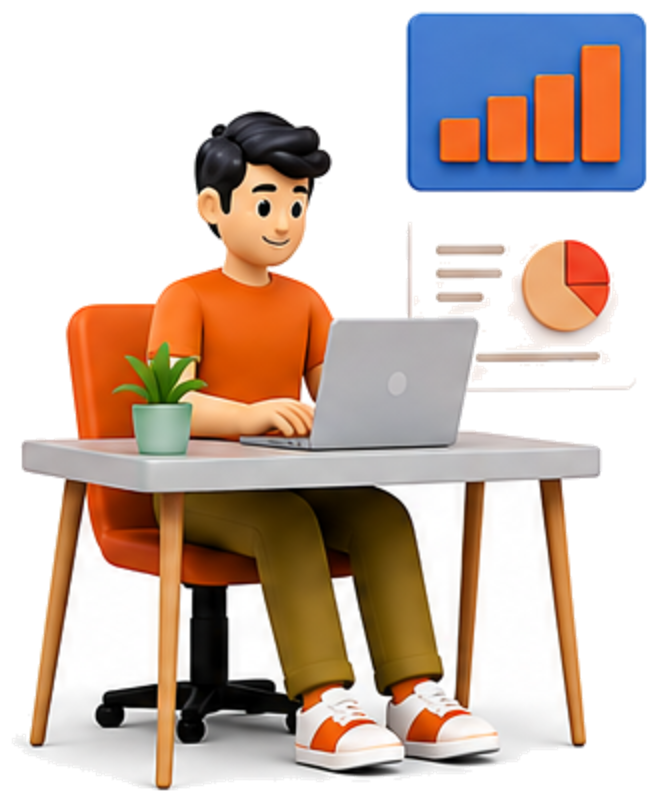

# Sahyog Hub — Project Knowledge Base

## Project Overview
The marketing/portfolio website for **Sahyog Hub**, a small digital agency founded by **Vimal** offering websites, apps, and Instagram/Facebook ad campaigns to local businesses. Single self-contained HTML file + SVG assets — no frameworks, no build tools.

> **Naming history:** the brand was originally **Sahyog Studio**, later renamed to **Sahyog Hub**. All site copy and file/folder names were updated at that time.

---

## REDESIGN — "ORANGE" (2026-08-07)

The site was rebuilt on an entirely new design, replacing the previous single-scrolling-page bronze/ink build. Source: claude.ai/design project `aacceed7-8584-4492-8c98-b76ed872b64c`, file `Sahyog Hub Website.dc.html` plus its embedded design system `_ds/sahyog-design-system-500147ca-...`, imported via DesignSync and reimplemented in plain HTML/CSS/vanilla JS per StaticSiteTemplate.md's design-import guidance (no DC-runtime, no `support.js`, no `image-slot.js` shipped).

### What the redesign CHANGED
| | Before | After |
|---|---|---|
| Brand colour | Bronze `#B4763C` on ink `#2C3040` | **Orange `#ea6018`** on white, with peach `#fff0e8` bands |
| Fonts | Space Grotesk + IBM Plex Mono | **Poppins** (display) + **DM Sans** (text) |
| Logo | Two-bracket mark `[ · ]` | **Wordmark only** — "Sah**yog** Hub" with "yog" in orange. No icon mark in the design. |
| Structure | One scrolling page, anchor links | **Four pages** — Home / Services / Work / Contact |
| Dark mode | Full light + dark theming | **Light only** — the design ships no dark palette |

**This is a real brand shift, not just a reskin.** The bronze/ink brand sheet (`Sahyog Studio Premium Logo` design project) and the artefacts in `Docs/` (`logo-directions.png`, `logo-s-ribbon.png`, `illustrations.png`) are all now **out of date** relative to the live site. Either refresh them to orange or treat them as historical.

### What was KEPT from the old site
- Real contact details: +91 95668 12835 (call + WhatsApp), vimaljkasp@gmail.com
- The WhatsApp-deep-link quote form (no backend, nothing stored)
- All three case studies and their real live-site screenshots
- "Founded by Vimal · Rajasthan, India", the सहयोग / "Together, we build" line
- Live links to all three client sites

---

## Brand Identity (current)
| Field | Value |
|-------|-------|
| Name | Sahyog Hub (सहयोग हब) |
| Meaning | Sahyog (सहयोग) = collaboration/cooperation |
| Tagline | "Together, we build" |
| Services line | Websites · Apps · Marketing Ads |
| Founder | Vimal |
| Location | Rajasthan, India |

---

## Contact Details
| Channel | Value |
|---------|-------|
| Call | +91 95668 12835 |
| WhatsApp | +91 95668 12835 (`wa.me/919566812835`) |
| Email | vimaljkasp@gmail.com |

---

## Design System (from the design project's tokens, copied verbatim)
**Orange ramp:** 50 `#fff5ef` · 100 `#ffe6d7` · 200 `#ffd0b5` · 300 `#fbb089` · 400 `#f5854f` · **500 `#ea6018` (brand)** · 600 `#d55311` (hover) · 700 `#b1420b` (press) · 800 `#8a3308` · 900 `#5e2205`

**Neutrals:** ink 900 `#1e1e1e` (headings) · 600 `#6b6b6b` (body) · 500 `#8a8a8a` (muted) · 300/200/100 · white

**Service tile accents:** yellow `#f5c400` (Websites) · green `#22c55e` (Apps) · violet `#7c5cf0` (Marketing Ads)

**Surfaces:** page `#ffffff` · warm band `#fff0e8` · card border `#f1e7e0`

**Type:** Poppins 400/500/600/700 (display) · DM Sans 400/500/700 (text). Display 56 / h1 44 / h2 34 / h3 24 / h4 18 / body-lg 17 / body 15 / body-sm 14 / caption 12.5 / micro 11.

**Layout:** container 1140px, gutter 24px, section padding 96px (64px small), header breakpoint **860px**.

Fonts load from Google Fonts CDN — fine on normal hosting, would fail under a strict CSP.

---

## Site Structure
Hash-routed single file. All four pages exist in the DOM at once and are toggled by a CSS class, so the content stays crawlable while URLs remain shareable and the back button works.

Routes: `#/` · `#/services` · `#/work` · `#/contact`
Deep links into a service block: `#/services#svc-websites`, `#svc-apps`, `#svc-ads` (the router parses the second `#` as an anchor and scrolls to it with a 92px header offset).
An unrecognised route falls back to Home.

**Home** — hero (headline, two CTAs, confetti dots, desk illustration) · "What We Build" three service cards on the peach band · "Simple Solutions!" four-step process + whiteboard illustration · "Recent Work" three client cards on the peach band.

> **Work cards carry proof, not just a name.** Each card (Home *and* the Work page) shows: a category eyebrow, a green "Live" dot, the project title, a one-line outcome, a row of feature pills (`.tags`), and the **live domain spelled out** as a link rather than a generic "View live site". The point is that a prospect can read what was actually built and click straight through to a working example. Pills wrap to two rows on mobile; verified clean at 320px.
**Services** — three alternating image/text blocks (Websites / Apps / Marketing Ads), each with a tick list; the Ads block has three sub-groups (Instagram, Facebook, both together).
**Work** — Meera Residency full-width feature, then Shree Leela + Mewad Gir Farms side by side.
**Contact** — call/WhatsApp/email cards + the quote form.
**CTA banner** — "Ready to get started?", overlaps the footer via `translateY(50%)`. Hidden on Contact (it links to the page you'd already be on).
**Footer** — wordmark, social/contact icon buttons, Services / Work / Contact columns, orange copyright bar.

---

## Tech Stack
| Technology | Usage |
|------------|-------|
| **HTML5** | Single file, four `.page` sections toggled by class |
| **CSS3** | Design tokens as custom properties, Grid/Flexbox, `auto-fit minmax` responsive columns, one media query at 860px for the nav |
| **Vanilla JS** | Hash router, mobile drawer, quote-form validation + WhatsApp deep link. ~90 lines, no dependencies. |
| **Inline SVG** | All icons (hand-written equivalents of the design's Lucide glyphs — the design masked them from a `unpkg` CDN, which would have added a runtime dependency) |
| **SVG files** | Five illustrations in `assets/` |
| **Google Fonts CDN** | Poppins, DM Sans |

**Files:**
- `index.html` — the whole site
- `assets/ill-*.webp` ×5 — what browsers actually download (179 KB total)
- `assets/ill-*.png` ×5 — the design's original 3D illustrations, RGBA; fallback only (see below)
- `assets/og-image.jpg` — 1200×630 social preview card
- `assets/case-study-meera.png`, `case-study-leela.jpg`, `case-study-mewad.jpg` — real live-site screenshots

> **Screenshots go stale when a client site is redesigned.** `case-study-mewad.jpg` was re-captured on 2026-08-07 because Mewad Gir Farms had been rebuilt on its "Olive" design — the old capture showed the retired dark theme with a blank box where the hero video sat. Meera and Shree Leela were checked at the same time and still match (verified by page background: `#0c1520` navy and `#2a1512` maroon respectively). **Re-check all three whenever a client site is redesigned.** Capture with html2canvas at an explicit width/height — on some of these sites `window.innerWidth/innerHeight` read 0, which silently produces a 0×0 canvas.

---

## Illustrations — the real artwork, and how it got here

The five illustrations are the design project's own 3D-rendered PNGs, supplied manually by the owner.

They could **not** be fetched through DesignSync: `get_file` caps reads at 256 KiB and every one of these exceeds it, so each came back at exactly 196,608 decoded bytes with `"truncated": true` and **no IEND chunk** — a corrupt PNG that would still partially decode. (Same failure mode StaticSiteTemplate.md warns about, and the same one hit on Mewad Gir Farms.) The site briefly shipped hand-drawn flat-vector SVG stand-ins; those were deleted once the real files arrived. **If these ever need re-fetching, download them through the browser — do not trust a DesignSync read of them.**

| File | Intrinsic size | Displayed at | Used on |
|---|---|---|---|
| `ill-desk-charts.png` | 658×802 | 470px | Home hero |
| `ill-whiteboard.png` | 668×748 | 400px | Home process |
| `ill-desktop-code.png` | 768×772 | 430px | Services — Websites |
| `ill-armchair-tablet.png` | 694×758 | 430px / 300px | Services — Apps; Contact |
| `ill-bean-mail.png` | 658×702 | 430px | Services — Marketing Ads |

All five are **RGBA with real transparency** — they sit directly on the white and peach `#fff0e8` bands. Do **not** convert them to JPEG; that would drop the alpha and put a white box on the peach sections.

**Served as WebP — the PNGs are fallback only.** The source PNGs total 2.3 MB, which was far too heavy for customers on mobile data. Each is now also shipped as WebP and delivered via `<picture>`:

```html
<picture style="display:block;width:100%;max-width:470px;margin-left:auto">
  <source srcset="assets/ill-desk-charts.webp" type="image/webp">
  
</picture>
```

| | PNG | WebP |
|---|---|---|
| Five illustrations | 2,310 KB | **179 KB** (−92%) |
| Hero alone (LCP) | 487 KB | **40 KB** |

Any browser without WebP support silently gets the PNG; Chrome never requests it (verified — `currentSrc` is `.webp` for all five).

> **How the WebP files were made:** no `sharp`, `cwebp` or ImageMagick is available in this environment (and note `convert` on Windows' PATH is the filesystem utility, *not* ImageMagick). They were encoded with **Chrome's own canvas encoder** — `fetch` the PNG same-origin → `createImageBitmap` → `canvas.toDataURL('image/webp', 0.86)` → decode the base64 to disk. Same trick works for re-encoding later. Verified afterwards that every file has a `RIFF/WEBP/VP8X` header **with the alpha flag set** — alpha matters, these sit on the peach bands and a flattened version would show a white box.

**Sizing lives on the `<picture>`, not the ``.** `<picture>` is inline by default and shrinks to fit, so `margin-left:auto` / `margin:0 auto` on the inner `` would silently stop positioning anything. The wrapper carries `display:block;width:100%;max-width:…` and the img is just `width:100%;height:auto;display:block`.

**Loading strategy.** All four pages live in the DOM at once, so a naive build would pull every illustration on first paint. Instead:
- The hero (`ill-desk-charts`) is eager with `fetchpriority="high"` — it is the LCP element.
- Every other illustration carries `loading="lazy" decoding="async"`. Because the Services and Contact pages are `display:none` until routed to, their images are never fetched until the visitor actually opens those pages.
- Verified: Home first paint requests **2** illustrations, not 5; the other three arrive only on navigating to Services.

Each `` also carries its true intrinsic `width`/`height` so the aspect ratio is reserved and there is no layout shift while they load.

> The real PNGs are **portrait** where the temporary SVGs were landscape, so the hero is taller than it was — 733px. On a 720px-tall viewport that pushes the next section just past the fold; at the design's own target height (1280×900) it sits comfortably. Not a bug, but worth knowing if the hero is ever re-tuned.

---

## Deliberately NOT Implemented

**Testimonials.** The design has a "What Clients Say!" section with two cards reading `[Client name]`, `[Role, company]` and `[Placeholder — a sentence on what the site changed for their business.]`, and its own subtitle says *"replace these with real client words before the site goes live."* Shipping it would have meant either publishing literal `[Client name]` placeholders or **inventing client quotes**, which would be fabricated social proof on a live commercial site. The section is omitted entirely. Add it back once real, attributable quotes exist — the card styling is straightforward (avatar initial in an orange circle, name in orange, role in muted micro text, quote, star rating).

---

## Bugs Found and Fixed During This Build
| Issue | Cause | Fix |
|---|---|---|
| Wordmark rendered as "SahyogHub" | `.wordmark` was `display:flex`; a flex container discards the whitespace text node between the `<span>` and "Hub" | Made it `display:inline-block` with `line-height:44px` (keeps the 44px touch target without flex) |
| Service deep-links (`#/services#svc-apps`) switched page but never scrolled | Only used `window.scrollTo({behavior:"smooth"})`, which is deferred indefinitely in embedded/preview contexts — the original design's author had already hit this and shipped a fallback, which was lost in reimplementation | Restored the fallback: after 380ms, if `pageYOffset` is still >4px from target, set `scrollingElement.scrollTop` directly |
| Top ~13px of all three service icon tiles was clipped off | One `.card-flush` class carrying `overflow:hidden` was applied to both the service and work cards. Work cards *must* clip (so the screenshot corners follow the card radius) but service cards must not — their icon tile is positioned at `top:-14px` to overhang the card edge. The design used two separate prop sets (`cardFillProps` vs `cardClipProps`) for exactly this reason. | Split into `.card-flush` (no clip, service cards) and `.card-clip` (clips, work cards) |
| iOS Safari zoomed the viewport whenever a quote-form field was focused, leaving visitors pinched in | All five controls inherited `--fs-body` (15px). iOS force-zooms any focused control under 16px. | `@media(max-width:859px){.field input,.field select,.field textarea{font-size:16px}}`. **This rule must stay *after* the `.field` block** — it has identical specificity, so source order is what makes it win. Desktop stays 15px as designed. |

---

## Mobile Audit (2026-08-07)
Swept **320×720, 375×812 and 414×896**, across all four routes, checking every element in the active page plus header, footer and CTA banner:
- **Horizontal overflow: none** at any width — `document.scrollWidth` equals the viewport exactly (320/375/414), and zero elements extend past either edge.
- **Tap targets: none under 40px** anywhere — every link, button, input, select and textarea clears it.
- **Text: nothing under 12px** rendered.
- Drawer nav opens, sets `aria-expanded`, and closes on navigation. Work-card feature pills wrap to two rows cleanly. CTA banner stacks and still straddles the footer.
- One real defect found and fixed: the iOS input-zoom issue (see the bug table above).

> **Caching gotcha while testing:** `npx serve` plus browser caching served a stale `index.html` and made a correct CSS fix look like it had failed. If a change appears not to apply, reload with a cache-busting query (`location.replace('/?v='+Date.now())`) before assuming the CSS is wrong. The fix above was verified only after a busted reload.

---

## Testing Done (2026-08-07)
Local server, desktop + mobile (375×812), zero console errors throughout.
- **Routing:** all four routes activate the right page and the right nav item; unknown route (`#/bogus`) falls back to Home; CTA banner hides only on Contact.
- **Deep links:** all three `#svc-*` anchors land the target at exactly 92px from the viewport top.
- **Form:** empty submit blocked with both field errors shown; a 5-digit phone still blocked; valid submit produces `https://wa.me/919566812835?text=...` with a correctly composed message.
- **Links:** 38 links audited — all `tel:`/`wa.me`/`mailto:` point at the real number and address; all three external client links carry `rel="noopener"`.
- **Mobile:** burger shows / desktop nav hides below 860px; drawer opens, sets `aria-expanded`, and closes on navigation; no horizontal overflow (`scrollWidth` = 375).
- **Assets:** all five illustrations and all three screenshots return 200.

Note for future sessions: `html2canvas` cannot rasterise externally-referenced SVG ``, so any capture of this page shows blank illustration slots. That is a capture artefact, not a site bug — real browser screenshots render them fine.

---

## What Still Needs To Be Done
- [x] **Hosting/domain** — LIVE at sahyoghub.com / www.sahyoghub.com via Cloudflare Pages, repo https://github.com/vimaljkasp/sahyog-hub
- [x] **Analytics** — Cloudflare Web Analytics, zone-wide, zero code changes
- [x] **Real illustrations** — the design's five PNGs are in, lazy-loaded (see above)
- [x] **Image weight** — WebP via `<picture>`, 2,310 KB → 179 KB (−92%); hero 487 KB → 40 KB
- [x] **og:image** — 1200×630 card at `assets/og-image.jpg`, wired up with Open Graph + Twitter tags
- [x] **Bronze-era artefacts** — moved to `Docs/archive-bronze/` with a README explaining what they were and why they no longer apply
- [ ] **Testimonials** — still blocked on real client quotes. See above; inventing them is not an option.
- [ ] **Logo mark** — the new design is wordmark-only; decide whether the bracket mark is retired for good or gets an orange version for the favicon and social avatar
- [ ] **Favicon** — currently an orange tile with a white "S" as an inline data-URI; a proper multi-size set (and a real social avatar) would be better
- [ ] **More case studies** — three so far

---

## Related Files
- Source website: `C:\Claude\Projects\sahyog-hub\SourceCode\index.html`
- Current design project: `aacceed7-8584-4492-8c98-b76ed872b64c` — `Sahyog Hub Website.dc.html`, `Sahyog Hub Logo.dc.html`
- Superseded bronze brand sheet: design project `5f9ff2f5-ed87-4349-8081-0fa0f468f410` (`Sahyog Studio Premium Logo`)
- Client projects used as case studies: `C:\Claude\Projects\meera-residency`, `C:\Claude\Projects\shree-leela-restaurant`, `C:\Claude\Projects\mewad-gir-farms`
- Shared static-site conventions: `C:\Claude\Projects\StaticSiteTemplate.md`
